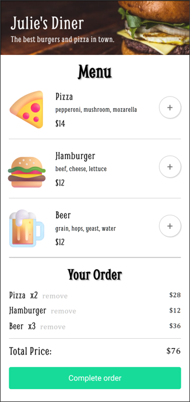
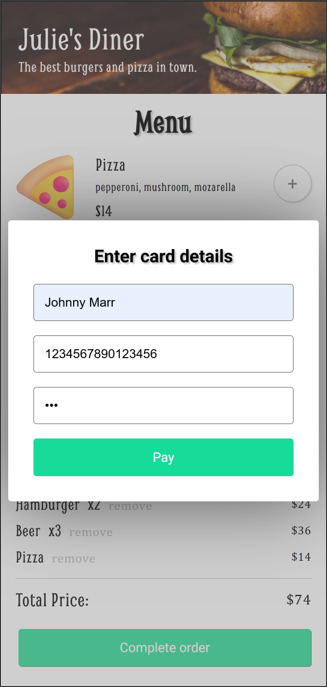
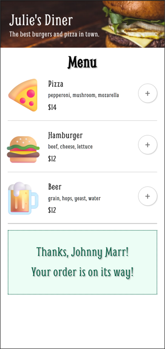

# Restaurant Ordering App
## A simple restaurant delivery app built with vanilla JavaScript, HTML, and CSS

- Built as an end-of-unit solo project in Scrimba's frontend developer path.
- Coded from scratch; design was provided as a Figma mockup by the course instructor.
- Improvements made to the original design for accessibility and aesthetic purposes.

